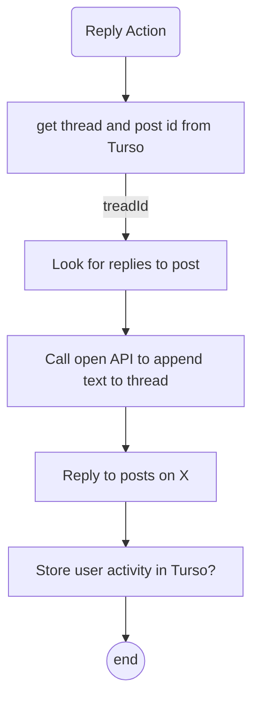

```mermaid
graph TD;
    A(Reply Action) --> B[get thread and post id from Turso]
    B -->|treadId| C[Look for replies to post]
    C --> D[Call open API to append text to thread]
    D --> E[Reply to posts on X]
    E --> F[Store user activity in Turso?]
    F --> G((end))
```
